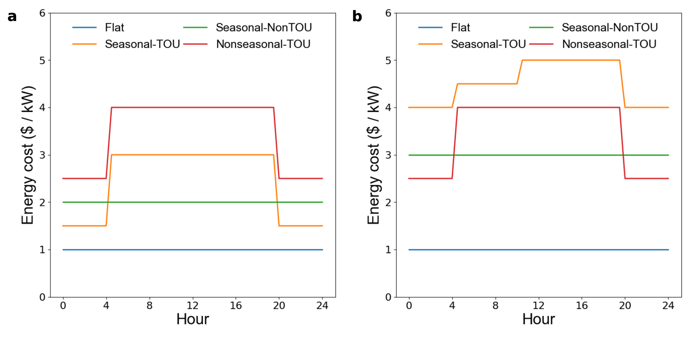

.. contents::

.. _complexities:

******************************************
What Makes Electricity Tariffs so Complex?
******************************************

To quote our paper, "Electricity and natural gas tariffs at United States wastewater treatment plants" [`Chapin 𝑁𝑎𝑡. 𝑆𝑐𝑖. 𝐷𝑎𝑡𝑎 (2024) <https://doi.org/10.1038/s41597-023-02886-6>`_]:

    Tariffs typically have three components: 
    (1) customer charges, or monthly minimum payments regardless of quantity of energy delivered, 
    which vary by type of customer (e.g., residential, commercial); 
    (2) energy charges billed by energy consumption in kWh or therms for electricity and natural gas, respectively; and 
    (3) demand charges billed by monthly maximum electricity or natural gas usage in kW and therms/hr, respectively, and averaged over 5-15 minute increments. 
    A therm is defined as 105.5 MJ, or the heat content of 100 cubic feet of methane at standard temperature and pressure.
    More complex tariffs may also have tiered energy and demand charges based on cumulative monthly demand, seasonal (i.e., monthly) and 
    time-of-use (i.e., daily and/or hourly) variation in marginal energy and demand charges, and bundled or decoupled generation and delivery charges.

Demand charges are particularly problematic for optimization problems since taking a maximum is not a matrix operation.
Tiered charges provide another challenge since assumptions will have to be made about what tier a customer will fall into before the optimization problem is solved,
but that assumption could be influenced by the results of the optimization problem (:ref:`why-consumption-est`).

We standardized a machine-readable format for storing tariff data that address the complexities of tarrif structure found across the United States (:ref:`data-format-tariff`).

.. _categorize-tariffs:

Categorizing Electricity Tariffs
================================

We also developed a categorization for the wide range of tariff structures present nationwide.
To summarize their attributes, we descriptively categorized tariffs on two dimensions: 

  1. the hourly, daily, and monthly variability of energy and demand charges (“temporality”), and
  2. whether electric power generation and delivery charges are bundled (“bundling”).

Temporality
***********

We categorize monthly electricity energy and demand charges into Flat, Seasonal-TOU, Nonseasonal-TOU, or Seasonal-NonTOU charges:
  
  1. Flat Charges: Charges are constant throughout the year.
  2. Seasonal-TOU Charges: Charges vary monthly (Seasonal) and daily and/or hourly (TOU).
  3. Nonseasonal-TOU Charges: Charges are consistent from month to month, but vary daily and/or hourly.
  4. Seasonal-NonTOU Charges: Charges vary monthly, but are constant from day to day and hour to hour.

    
    Representative flat, time-of-use (TOU), and seasonal price profiles. (a) Winter prices and (b) summer prices representing Flat, Seasonal-TOU, Nonseasonal-TOU, and Seasonal-NonTOU tariffs. Cost would be calculated in $/kW, $/(therm/hr), $/kWh, or $/therm for electricity demand charges, natural gas demand charges, electricity energy charges, and natural gas energy charges, respectively. A therm is defined as 105.5 MJ, or approximately the heat content of 100 cubic feet of natural gas.

Bundling
********
In the United States, generation, transmission, and distribution charges are commonly bundled into a single electricity energy charge. 
However, in some cases facilities pay separate generation (or supply) and delivery (or transmission and distribution) charges to a single provider or to generation and delivery providers separately. 
For example, in much of the Texas interconnection, delivery and generation service providers are distinct.

We developed a second categorization scheme for electricity tariffs based on the extent to which generation and delivery charges are bundled:

  1. Class 1: Fully bundled generation (supply) and delivery (transmission and distribution) charges.
  2. Class 2: Bundled generation and delivery charges with fuel cost adjustment based on the market price of fossil fuels.
  3. Class 3: Generation and delivery service from the same provider with pre-defined charges.
  4. Class 4: Generation and delivery service from the same provider with pre-defined delivery charges and variable generation charges that reflect real-time or day-ahead electricity prices set by the live market.
  5. Class 5: Generation and delivery service providers are legally required to be separate, and delivery charges are directly negotiated between customers and utilities. As a result, delivery charges are not published in tariff books, but can be obtained through public information requests.
