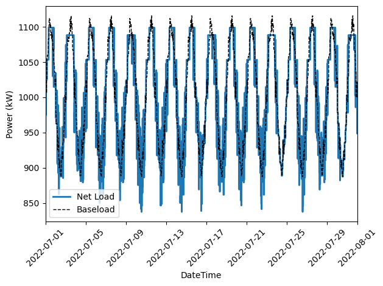

.. contents::

.. _tutorial-cost:

**************************
Optimize Electricity Costs
**************************

This tutorial will walk through how to optimize electricity bill savings for a simple battery model in either :ref:`cvx-cost` or :ref:`pyo-cost` by going through the following steps:

  #. Load an electricity tariff spreadsheet

     - We publish a nationwide tariff dataset: https://github.com/we3lab/industrial-electricity-tariffs
     - In this case, we use `tariff.csv <https://github.com/we3lab/eeco/blob/main/eeco/data/tariff.csv>`_ from the EECO `data` folder
  #. Configure an optimization model of the electricity consumer with system constraints
  
     - Consider using flexibility metrics to encode system constraints (:ref:`tutorial-metrics`)!
     - The models are presented step-by-step to demonstrate the model building process, 
       but the complete models are available in the `examples` folder:

       - `pyomo_battery_model.py <https://github.com/we3lab/eeco/blob/main/examples/pyomo_battery_model.py>`_
       - `cvxpy_battery_model.py <https://github.com/we3lab/eeco/blob/main/examples/cvxpy_battery_model.py>`_
  #. Create an objective function of electricity costs based on this tariff sheet
  #. Minimize the electricity costs of this consumer, given the system constraints and base load consumption
  #. Display the results to validate that the optimization is correct

.. _cvx-cost:

CVXPY
=====

0. Import dependencies

.. code-block:: python
   
    import datetime
    import cvxpy as cp
    import pandas as pd
    import matplotlib.pyplot as plt
    from eeco import costs 

1. Load an electricity tariff spreadsheet

.. code-block:: python
   
    path_to_tariff_sheet = "eeco/data/tariff.csv"
    tariff_df = pd.read_csv(path_to_tariff_sheet, sep=",")
   
    # get the charge dictionary
    charge_dict = costs.get_charge_dict(
        datetime.datetime(2023, 4, 9), datetime.datetime(2023, 4, 11), tariff_df, resolution="1m"
    )

We are going to evaluate the electricity consumption from only April 9th to April 10th since that is where our 
synthetic data comes from (https://github.com/we3lab/eeco/blob/main/eeco/data/consumption.csv).
You will also see that it is in 1-minute intervals, hence `resolution="1m"`.
If you print `charge_dict`, then you should get the following:

.. code-block:: python

    {
        'electric_customer_0_20230409_20230410_0': array([666.65]), 
        'electric_energy_0_20230409_20230410_0': array([0., 0., 0., ..., 0., 0., 0.]), 
        'electric_energy_1_20230409_20230410_0': array([0., 0., 0., ..., 0., 0., 0.]), 
        'electric_energy_2_20230409_20230410_0': array([0., 0., 0., ..., 0., 0., 0.]), 
        'electric_energy_3_20230409_20230410_0': array([0., 0., 0., ..., 0., 0., 0.]), 
        'electric_energy_4_20230409_20230410_0': array([0. , 0. , 0. , ..., 0.0189944, 0.0189944, 0.0189944]), 
        'electric_energy_5_20230409_20230410_0': array([0., 0., 0., ..., 0., 0., 0.]), 
        'electric_energy_6_20230409_20230410_0': array([0., 0., 0., ..., 0., 0., 0.]), 
        'electric_energy_7_20230409_20230410_0': array([0., 0., 0., ..., 0., 0., 0.]), 
        'electric_energy_8_20230409_20230410_0': array([0., 0., 0., ..., 0., 0., 0.]), 
        'electric_energy_9_20230409_20230410_0': array([0., 0., 0., ..., 0., 0., 0.]), 
        'electric_energy_10_20230409_20230410_0': array([0., 0., 0., ..., 0., 0., 0.]), 
        'electric_energy_11_20230409_20230410_0': array([0., 0., 0., ..., 0., 0., 0.]), 
        'electric_energy_12_20230409_20230410_0': array([0., 0., 0., ..., 0., 0., 0.]), 
        'electric_energy_13_20230409_20230410_0': array([0., 0., 0., ..., 0., 0., 0.]), 
        'electric_energy_14_20230409_20230410_0': array([0.0189944, 0.0189944, 0.0189944, ..., 0. , 0. , 0. ]), 
        'electric_energy_15_20230409_20230410_0': array([0., 0., 0., ..., 0., 0., 0.]), 
        'electric_energy_16_20230409_20230410_0': array([0., 0., 0., ..., 0., 0., 0.]), 
        'electric_demand_0_20230409_20230410_0': array([0., 0., 0., ..., 0., 0., 0.]), 
        'electric_demand_1_20230409_20230410_0': array([0., 0., 0., ..., 0., 0., 0.]), 
        'electric_demand_2_20230409_20230410_0': array([ 0.  ,  0.  ,  0.  , ..., 19.79, 19.79, 19.79]), 
        'electric_demand_3_20230409_20230410_0': array([19.79, 19.79, 19.79, ...,  0.  ,  0.  ,  0.  ])
    }

2. Configure an optimization model of the electricity consumer with system constraints

.. code-block:: python

    # load historical consumption data
    load_df = pd.read_csv("eeco/data/consumption.csv", parse_dates=["Datetime"])

    # set battery parameters
    # create variables for battery total energy, max charge and discharge power, and SOC limits
    total_capacity = 10 # kWh
    min_soc = 0 
    max_soc = 1
    init_soc = 0.5
    fin_soc = 0.5
    max_discharge = 5 # kW
    max_charge = 5 # kW
    T = len(load_df["Datetime"])
    delta_t = ((load_df.iloc[-1]["Datetime"] - load_df.iloc[0]["Datetime"]) / T) / datetime.timedelta(hours=1)

    # initialize variables
    battery_output_kW = cp.Variable(T)
    battery_soc = cp.Variable(T+1)
    grid_demand_kW = cp.Variable(T)

    # set constraints
    constraints = [
        battery_output_kW >= -max_discharge,
        battery_output_kW <= max_charge,
        battery_soc >= min_soc,
        battery_soc <= max_soc,
        battery_soc[0] == init_soc,
        battery_soc[T] == fin_soc,
        grid_demand_kW >= 0
    ]
    for t in range(T):
        constraints += [
            battery_soc[t+1] == battery_soc[t] + (battery_output_kW[t] * delta_t) / total_capacity,
            grid_demand_kW[t] == load_df.iloc[t]["Load [kW]"] + battery_output_kW[t]
        ]

This is a standard battery model with energy (i.e., total charge) and power (i.e., discharge/charge rate) constraints.
The round-trip efficiency is 1.0 since there is no penalty applied when discharging the battery, 
but that's fine for these demonstration purposes.

3. Create an objective function of electricity costs based on this tariff sheet

.. code-block:: python

    # requires a consumption dictionary in case there is natural gas in addition to electricity
    consumption_data_dict = {"electric": grid_demand_kW}
    # NOTE: second entry of the tuple can be ignored since it's for Pyomo
    obj, _ = costs.calculate_cost(
        charge_dict,
        {"electric": grid_demand_kW},
        resolution="1m",
        consumption_estimate=load_df["Load [kW]"].sum(),
        desired_utility="electric",
    )

The charge and consumption dictionaries are relatively straightforward: 
`charge_dict` comes from EECO and `consumption_data_dict` is either an optimization variable or
numpy array (in the case of historical analysis).
The only caveat would be that an entry with key "gas" must be included to analyze natural gas consumption.

Carefully note that the function `calculate_cost` returns a tuple. 
The second entry of the tuple is for Pyomo, so it can be ignored since we are using CVXPY.

The `resolution` argument represents the temporal granularity of the data in string format. 
The default value is "15m" for 15-minute intervals, but our consumption data is on 1-minute intervals,
so we use `resolution="1m"` (just like with `charge_dict`).

For this simple example the `prev_demand_dict`, `prev_consumption_dict`, `demand_scale_factor`, `desired_charge_type`, 
and `varstr_alias_func` have not been used. More information on how to use those flags is available in :ref:`how-to-advanced`.

4. Minimize the electriciy costs of this consumer given the system constraints and base load consumption

.. code-block:: python

    # solve the CVX problem (objective variable should be named obj)
    prob = cp.Problem(cp.Minimize(obj), constraints)
    prob.solve()

5. Display the results to validate that the optimization is correct

Always compute the ex-post cost using numpy due to the convex relaxations that we apply in our optimization code:

.. code-block:: python

    # NOTE: second entry of the tuple can be ignored since it's for Pyomo
    baseline_electricity_cost, _ = costs.calculate_cost(
        charge_dict,
        {"electric": load_df["Load [kW]"].values},
        resolution="1m",
        desired_utility="electric",
    )
    # NOTE: second entry of the tuple can be ignored since it's for Pyomo
    optimized_electricity_cost, _ = costs.calculate_cost(
        charge_dict,
        {"electric": grid_demand_kW.value},
        resolution="1m",
        desired_utility="electric",
    )

Note that the `consumption_estimate` optional argument is not needed because the electricity consumption is a numpy array instead of an optimization variable.
If we print our results, we confirm that the optimal electricity profile has a bill of 
$703.81, $61.48 less than the baseline bill of $765.29.

.. code-block:: python

    >>>print(f"Baseline Electricity Cost: ${baseline_electricity_cost:.2f}")
    Baseline Electricity Cost: $765.29
    >>>print(f"Optimized Electricity Cost: ${optimized_electricity_cost:.2f}")
    Optimized Electricity Cost: $703.81

Below are a few simple plots to validate our results. 
First, we visualize the energy and demand charges:

.. code-block:: python

    # this can also be done in a dataframe format that drops all the unnecessary columns
    charge_df = costs.get_charge_df(datetime.datetime(2023, 4, 9), datetime.datetime(2023, 4, 11), tariff_df, resolution="1m")
    charge_df.head()
    
    # create a subset of the charge_df for energy and demand charges
    energy_charge_df = charge_df.filter(like="energy")
    demand_charge_df = charge_df.filter(like="demand")

    # sum across all energy charges
    total_energy_charge = energy_charge_df.sum(axis=1)

    fig, ax = plt.subplots(2, 1, figsize=(10, 8))
    # plot the energy charges
    ax[0].plot(charge_df["DateTime"], total_energy_charge)
    ax[0].set(
        xlabel="DateTime", 
        ylabel="Energy Charge ($/kWh)", 
        xlim=(datetime.datetime(2023, 4, 9), datetime.datetime(2023, 4, 11))
    )

    # plot the demand charges
    ax[1].plot(charge_df["DateTime"], demand_charge_df)
    ax[1].set(
        xlabel="DateTime", 
        ylabel="Demand Charge ($/kWh)", 
        xlim=(datetime.datetime(2023, 4, 9), 
        datetime.datetime(2023, 4, 11)), 
        ylim=[0,None]
    )

    fig.align_ylabels()
    fig.tight_layout()
    fig.suptitle("Electricity Charges",y=1.02, fontsize=16)
    plt.show()

    
    Structure of time-of-use (TOU) energy and demand charges for our modeling period (April 9-10, 2023).
    Different colors indicate different demand charge periods.
    Note that because April 9th is a Sunday, there are no TOU charges until Monday (April 10th).

Next, we plot the baseline and optimal electricity consumption profiles.
This helps us to visualize how the model responds to the cost incentives of the tariff.

.. code-block:: python

    # plot the model outputs
    fig, ax = plt.subplots()
    ax.step(charge_df["DateTime"], grid_demand_kW.value, color="C0", lw=2, label="Net Load")
    ax.step(charge_df["DateTime"], load_df["Load [kW]"].values, color="k", lw=1, ls='--', label="Baseload")
    ax.set(xlabel="DateTime", ylabel="Power (kW)", xlim=(datetime.datetime(2023, 4, 9), datetime.datetime(2023, 4, 11)))
    plt.xticks(rotation=45)
    fig.tight_layout()
    plt.legend()

.. figure:: _static/img/cvx-cost-model-out.png
    
    Output of our electricity bill optimization using the virtual battery model.
    The dotted line is baseline electricity purchases, and the blue line is the optimized profile.
    Note how the optimized electricity profile shaves peaks to readuce time-of-use (TOU) charges

Finally, let's plot the battery state of charge (SOC) to confirm that the constraints were respected:

.. code-block:: python

    # plot the battery charge
    fig, ax = plt.subplots()
    ax.step(charge_df["DateTime"], battery_soc.value[1:], color="C1", lw=2, label="Battery SOC")
    ax.set(
        xlabel="Time", 
        ylabel="Battery SOC", 
        ylim=[0,1], 
        xlim=(datetime.datetime(2023, 4, 9), datetime.datetime(2023, 4, 11))
    )
    plt.xticks(rotation=45)
    fig.tight_layout()

.. figure:: _static/img/cvx-cost-battery-soc.png
    
    Battery state of charge (SOC) as a percentage during our modeling period (April 9-10, 2023).

.. _pyo-cost:

Pyomo
=====

0. Import dependencies

.. code-block:: python
   
    import datetime
    import numpy as np 
    import pandas as pd
    import pyomo.environ as pyo
    import matplotlib.pyplot as plt
    from eeco import costs 
    from examples.pyomo_battery_model import BatteryPyomo

1. Load an electricity tariff spreadsheet

.. code-block:: python
   
    path_to_tariffsheet = "eeco/data/tariff.csv"
    tariff_df = pd.read_csv(path_to_tariffsheet, sep=",")
   
    # get the charge dictionary
    charge_dict = costs.get_charge_dict(
        datetime.datetime(2022, 7, 1), datetime.datetime(2022, 8, 1), tariff_df, resolution="15m"
    )

We are going to evaluate the electricity consumption for the entire month of July 2022.
Below we will create synthetic `baseload` data for this month with 15-minute resolution, so `resolution="15m"`.
If you print `charge_dict`, then you should get the following:

.. code-block:: python

    {
        'electric_customer_0_2022-07-01_2022-07-31_0': array([666.65]),
        'electric_energy_0_2022-07-01_2022-07-31_0': array([0., 0., 0., ..., 0., 0., 0.], shape=(2976,)),
        'electric_energy_1_2022-07-01_2022-07-31_0': array([0., 0., 0., ..., 0., 0., 0.], shape=(2976,)),
        'electric_energy_2_2022-07-01_2022-07-31_0': array([0., 0., 0., ..., 0., 0., 0.], shape=(2976,)),
        'electric_energy_3_2022-07-01_2022-07-31_0': array([0., 0., 0., ..., 0., 0., 0.], shape=(2976,)),
        'electric_energy_4_2022-07-01_2022-07-31_0': array([0., 0., 0., ..., 0., 0., 0.], shape=(2976,)),
        'electric_energy_5_2022-07-01_2022-07-31_0': array([0.0254538, 0.0254538, 0.0254538, ..., 0. , 0. , 0. ], shape=(2976,)),
        'electric_energy_6_2022-07-01_2022-07-31_0': array([0., 0., 0., ..., 0., 0., 0.], shape=(2976,)),
        'electric_energy_7_2022-07-01_2022-07-31_0': array([0., 0., 0., ..., 0., 0., 0.], shape=(2976,)),
        'electric_energy_8_2022-07-01_2022-07-31_0': array([0., 0., 0., ..., 0., 0., 0.], shape=(2976,)),
        'electric_energy_9_2022-07-01_2022-07-31_0': array([0., 0., 0., ..., 0., 0., 0.], shape=(2976,)),
        'electric_energy_10_2022-07-01_2022-07-31_0': array([0., 0., 0., ..., 0., 0., 0.], shape=(2976,)),
        'electric_energy_11_2022-07-01_2022-07-31_0': array([0., 0., 0., ..., 0., 0., 0.], shape=(2976,)),
        'electric_energy_12_2022-07-01_2022-07-31_0': array([0., 0., 0., ..., 0., 0., 0.], shape=(2976,)),
        'electric_energy_13_2022-07-01_2022-07-31_0': array([0., 0., 0., ..., 0., 0., 0.], shape=(2976,)),
        'electric_energy_14_2022-07-01_2022-07-31_0': array([0., 0., 0., ..., 0., 0., 0.], shape=(2976,)),
        'electric_energy_15_2022-07-01_2022-07-31_0': array([0. , 0. , 0. , ..., 0.0254538, 0.0254538, 0.0254538], shape=(2976,)),
        'electric_energy_16_2022-07-01_2022-07-31_0': array([0., 0., 0., ..., 0., 0., 0.], shape=(2976,)),
        'electric_demand_0_2022-07-01_2022-07-31_0': array([19.79, 19.79, 19.79, ...,  0.  ,  0.  ,  0.  ], shape=(2976,)),
        'electric_demand_1_2022-07-01_2022-07-31_0': array([0., 0., 0., ..., 0., 0., 0.], shape=(2976,)),
        'electric_demand_2_2022-07-01_2022-07-31_0': array([0., 0., 0., ..., 0., 0., 0.], shape=(2976,)),
        'electric_demand_3_2022-07-01_2022-07-31_0': array([ 0.  ,  0.  ,  0.  , ..., 19.79, 19.79, 19.79], shape=(2976,))
    }

2. Configure an optimization model of the electricity consumer with system constraints

We rely on the virtual battery model in `pyomo_battery_model.py <https://github.com/we3lab/eeco/blob/main/examples/pyomo_battery_model.py>`_.
We're going to stick to the electricity cost calculation details, but we encourage you to go check out the code to better understand the model.

.. code-block:: python

    # Define the parameters for the battery model
    battery_params = {
        "start_date": "2022-07-01 00:00:00",
        "end_date": "2022-08-01 00:00:00",
        "timestep": 0.25,   # 15 minutes defined in hours
        "rte": 0.86,
        "energycapacity": 100,
        "powercapacity": 50,
        "soc_min": 0.05,
        "soc_max": 0.95,
        "soc_init": 0.5,
    }

    # Create a sample baseload profile based on a sine wave
    baseload = np.sin(np.linspace(0, 4 * np.pi, 96))*100 + 1000 + np.random.normal(0, 10, 96)

    # Create an instance of the BatteryOpt class
    battery = BatteryPyomo(battery_params, baseload, baseload_repeat=True)

    # create the model on the instance battery
    battery.create_model()

The above code initializes the battery model with flexibility metrics, like round-trip efficiency (RTE), 
power capacity, and energy capacity.

3. Create an objective function of electricity costs based on this tariff sheet

.. code-block:: python

    # monthly total consumption - divided by 4 because of 15-min resolution
    consumption_estimate = sum(baseload) / 4
    # this example tariff only has electric utility types so we do not pass the gas key
    consumption_data_dict = {"electric": battery.model.net_facility_load}
    battery.model.electricity_cost, battery.model = costs.calculate_cost(
        charge_dict,
        consumption_data_dict,
        resolution="15m",
        consumption_estimate=consumption_estimate,
        desired_utility="electric",
        model=battery.model,
    )
    # create an attribute objective based on the electricity cost
    battery.model.objective = pyo.Objective(
        expr=battery.model.electricity_cost,
        sense=pyo.minimize,
    )

4. Minimize the electriciy costs of this consumer given the system constraints and base load consumption

.. code-block:: python

    # use the glpk solver to solve the model - (any pyomo-supported LP solver will work here)
    solver = pyo.SolverFactory("glpk")
    results = solver.solve(battery.model, tee=False) # turn tee=True to see solver output

5. Display the results to validate that the optimization is correct

Always compute the ex-post cost using numpy due to the convex relaxations that we apply in our optimization code:

.. code-block:: python

    # retrieve outputs from Pyomo model
    net_load = np.array([battery.model.net_facility_load[t].value for t in battery.model.t])
    baseload = np.array([battery.model.baseload[t] for t in battery.model.t])
    # NOTE: second entry of the tuple can be ignored since it's for Pyomo
    baseline_electricity_cost = costs.calculate_cost(
        charge_dict,
        {"electric": baseload},
        resolution="15m",
        desired_utility="electric",
    )
    # NOTE: second entry of the tuple can be ignored since it's for Pyomo
    optimized_electricity_cost, _ = costs.calculate_cost(
        charge_dict,
        {"electric": net_load},
        resolution="15m",
        desired_utility="electric",
    )

Note that the `consumption_estimate` optional argument is not needed because the electricity consumption is a numpy array instead of an optimization variable.
If we print our results, we confirm that the optimal electricity profile has a bill of 
$113384.23, $2182.47 less than the baseline bill of $115566.70.

.. code-block:: python

    >>>print(f"Baseline Electricity Cost: ${baseline_electricity_cost:.2f}")
    Baseline Electricity Cost: $115566.70
    >>>print(f"Optimized Electricity Cost: ${optimized_electricity_cost:.2f}")
    Optimized Electricity Cost: $113384.23

Below are a few simple plots to validate our results.
First, we visualize the energy and demand charges:

.. code-block:: python

    # this can also be done in a dataframe format that drops all the unnecessary columns
    charge_df = costs.get_charge_df(battery.start_dt, battery.end_dt, tariff_df, resolution="15m")
    charge_df.head()

    # create a subset of the charge_df for energy and demand charges
    energy_charge_df = charge_df.filter(like="energy")
    demand_charge_df = charge_df.filter(like="demand")

    # sum across all energy charges
    total_energy_charge = energy_charge_df.sum(axis=1)

    fig, ax = plt.subplots(2, 1, figsize=(10, 8))
    # plot the energy charges
    ax[0].plot(charge_df["DateTime"], total_energy_charge)
    ax[0].set(xlabel="DateTime", ylabel="Energy Charge ($/kWh)", xlim=(battery.start_dt, battery.end_dt))

    # plot the demand charges
    ax[1].plot(charge_df["DateTime"], demand_charge_df)
    ax[1].set(xlabel="DateTime", ylabel="Demand Charge ($/kWh)", xlim=(battery.start_dt, battery.end_dt), ylim=[0,None])

    fig.align_ylabels()
    fig.tight_layout()
    fig.suptitle("Electricity Charges",y=1.02, fontsize=16)
    plt.show()

.. figure:: _static/img/pyo-tariff-structure.png
    
    Structure of time-of-use (TOU) energy and demand charges for our modeling period (July 2022).

Next, we plot the baseline and optimal electricity consumption profiles.
This helps us to visualize how the model responds to the cost incentives of the tariff.

.. code-block:: python

    # plot the model outputs
    fig, ax = plt.subplots()
    ax.step(charge_df["DateTime"], net_load, color="C0", lw=2, label="Net Load")
    ax.step(charge_df["DateTime"], baseload, color="k", lw=1, ls='--', label="Baseload")
    ax.set(xlabel="DateTime", ylabel="Power (kW)", xlim=(battery.start_dt, battery.end_dt))
    plt.xticks(rotation=45)
    fig.tight_layout()
    plt.legend()

    
    Output of our electricity bill optimization using the virtual battery model.
    The dotted line is baseline electricity purchases, and the blue line is the optimized profile.
    Note how the optimized electricity profile shaves peaks to readuce time-of-use (TOU) charges

Finally, let's plot the battery state of charge (SOC) to confirm that the constraints were respected:

.. code-block:: python

    # plot the battery charge
    battery_charge = np.array([battery.model.soc[t].value for t in battery.model.t])
    fig, ax = plt.subplots()
    ax.step(charge_df["DateTime"], battery_charge, color="C1", lw=2, label="Battery SOC")
    ax.set(xlabel="Time", ylabel="Battery SOC", ylim=[0,1], xlim=(battery.start_dt, battery.end_dt))
    plt.xticks(rotation=45)
    fig.tight_layout()

    
    Battery state of charge (SOC) as a percentage during our modeling period (July 2022).
