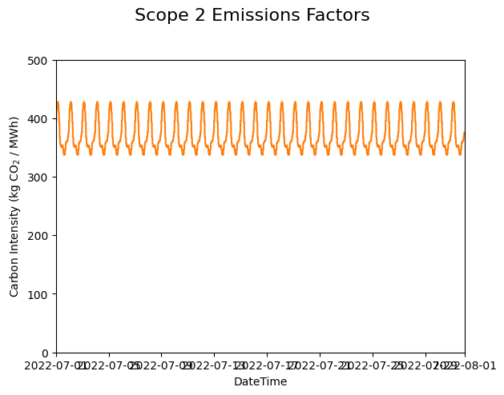
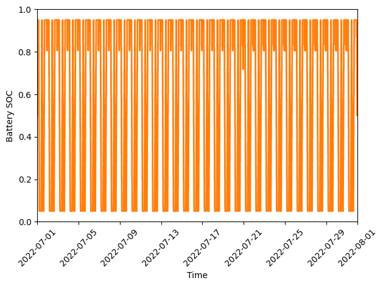

.. contents::

.. _tutorial-emit:

**************************
Optimize Scope 2 Emissions
**************************

This tutorial will walk through how to optimize Scope 2 emissions for a simple battery model in either :ref:`cvx-emit` or :ref:`pyo-emit` by going through the following steps:

  #. Load a Scope 2 emissions spreadsheet
  #. Configure an optimization model of the electricity consumer with system constraints
  
     - Consider using flexibility metrics to encode system constraints (:ref:`tutorial-metrics`)!
     - The models are presented step-by-step to demonstrate the model-building process, 
       but the complete models are available in the `examples` folder:

       - `pyomo_battery_model.py <https://github.com/we3lab/eeco/blob/main/examples/pyomo_battery_model.py>`_
       - `cvxpy_battery_model.py <https://github.com/we3lab/eeco/blob/main/examples/cvxpy_battery_model.py>`_
  #. Create an objective function of Scope 2 emissions using the emissions factors
  #. Minimize the Scope 2 emissions of this consumer, given the system constraints and base load consumption
  #. Display the results to validate that the optimization is correct

.. _cvx-emit:

CVXPY
=====

0. Import dependencies

.. code-block:: python
   
    import datetime
    import cvxpy as cp
    import pandas as pd
    import matplotlib.pyplot as plt
    from eeco.units import u
    from eeco import emissions

1. Load a Scope 2 emissions spreadsheet

.. code-block:: python
   
    path_to_emissions_sheet = "eeco/data/emissions.csv"
    emission_df = pd.read_csv(path_to_emissions_sheet, sep=",")
   
    # get the charge dictionary
    carbon_intensity = emissions.get_carbon_intensity(
        datetime.datetime(2023, 4, 9), datetime.datetime(2023, 4, 11), emission_df, resolution="1m"
    )

We are going to evaluate the electricity consumption from only April 9th to April 10th since that is where our 
synthetic data comes from (https://github.com/we3lab/eeco/blob/main/eeco/data/consumption.csv).
You will also see that it is in 1-minute intervals, hence `resolution="1m"`.

2. Configure an optimization model of the electricity consumer with system constraints

.. code-block:: python

    # load historical consumption data
    load_df = pd.read_csv("eeco/data/consumption.csv", parse_dates=["Datetime"])

    # set battery parameters
    # create variables for battery total energy, max charge and discharge power, and SOC limits
    total_capacity = 10 # kWh
    min_soc = 0 
    max_soc = 1
    init_soc = 0.5
    fin_soc = 0.5
    max_discharge = 5 # kW
    max_charge = 5 # kW
    T = len(load_df["Datetime"])
    delta_t = ((load_df.iloc[-1]["Datetime"] - load_df.iloc[0]["Datetime"]) / T) / datetime.timedelta(hours=1)

    # initialize variables
    battery_output_kW = cp.Variable(T)
    battery_soc = cp.Variable(T+1)
    grid_demand_kW = cp.Variable(T)

    # set constraints
    constraints = [
        battery_output_kW >= -max_discharge,
        battery_output_kW <= max_charge,
        battery_soc >= min_soc,
        battery_soc <= max_soc,
        battery_soc[0] == init_soc,
        battery_soc[T] == fin_soc,
        grid_demand_kW >= 0
    ]
    for t in range(T):
        constraints += [
            battery_soc[t+1] == battery_soc[t] + (battery_output_kW[t] * delta_t) / total_capacity,
            grid_demand_kW[t] == load_df.iloc[t]["Load [kW]"] + battery_output_kW[t]
        ]

This is a standard battery model with energy (i.e., total charge) and power (i.e., discharge/charge rate) constraints.
The round-trip efficiency is 1.0 since there is no penalty applied when discharging the battery, 
but that's fine for these demonstration purposes.

3. Create an objective function of Scope 2 emissions using the emissions factors

.. code-block:: python

    # NOTE: second entry of the tuple can be ignored since it's for Pyomo
    obj, _ = emissions.calculate_grid_emissions(
        carbon_intensity,
        grid_demand_kW,
        resolution="1m",
        consumption_units=u.kW
    )

There is also an optional `emissions_units` argument that we do not use in the above example.
That is because `get_carbon_intensity` returns a `pint.Quantity` from which we can automatically parse the emissions units.

4. Minimize the Scope 2 emissions of this consumer, given the system constraints and base load consumption

.. code-block:: python

    # solve the CVX problem (objective variable should be named obj)
    prob = cp.Problem(cp.Minimize(obj), constraints)
    prob.solve()

5. Display the results to validate that the optimization is correct

We will compare baseline to optimized emissions. 
Unlike :ref:`tutorial-cost`, there are no convex relaxations during problem formulation, so the objective function can be used directly to quantify emissions.

.. code-block:: python

    # NOTE: second entry of the tuple can be ignored since it's for Pyomo
    baseline_emissions, _ = emissions.calculate_grid_emissions(
        carbon_intensity,
        load_df["Load [kW]"].values,
        resolution="1m",
        consumption_units=u.kW
    )
    # NOTE: second entry of the tuple can be ignored since it's for Pyomo
    optimized_emissions = obj.value

If we print our results, we confirm that the optimal electricity profile has emissions of
9.74 kg CO:sub:`2`-eq, 0.95 kg CO:sub:`2`-eq less than the baseline emissions of 10.69 kg CO:sub:`2`-eq.

.. code-block:: python

    >>>print(f"Baseline Scope 2 Emissions: {baseline_emissions:.2f} kg CO_2-eq")
    Baseline Scope 2 Emissions: 10.69 kilogram kg CO_2-eq
    >>>print(f"Optimized Scope 2 Emissions: {optimized_emissions:.2f} kg CO_2-eq")
    Optimized Scope 2 Emissions: 9.74 kilogram kg CO_2-eq

Below are a few simple plots to validate our results. 
First, we visualize the emissions factors:

.. code-block:: python

    fig, ax = plt.subplots()

    # plot the emissions factors
    ax.plot(load_df["Datetime"], carbon_intensity.to(u.kg / u.MWh))
    ax.set(
        xlabel="DateTime", 
        ylabel="Carbon Intensity (kg CO$_2$ / MWh)", 
        xlim=(datetime.datetime(2023, 4, 9), 
        datetime.datetime(2023, 4, 11)), 
        ylim=[0,500]
    )

    fig.align_ylabels()
    fig.tight_layout()
    fig.suptitle("Scope 2 Emissions Factors",y=1.02, fontsize=16)
    plt.show()

.. figure:: _static/img/cvx-carbon-intensity.png
    
    Average Scope 2 emissions factors for our modeling period (April 9-10, 2023).

Next, we plot the baseline and optimal electricity consumption profiles.
This helps us to visualize how the model responds to the cost incentives of the tariff.

.. code-block:: python

    # plot the model outputs
    fig, ax = plt.subplots()
    ax.step(load_df["Datetime"], grid_demand_kW.value, color="C0", lw=2, label="Net Load")
    ax.step(load_df["Datetime"], load_df["Load [kW]"].values, color="k", lw=1, ls='--', label="Baseload")
    ax.set(xlabel="DateTime", ylabel="Power (kW)", xlim=(datetime.datetime(2023, 4, 9), datetime.datetime(2023, 4, 11)))
    plt.xticks(rotation=45)
    fig.tight_layout()
    plt.legend()
    plt.show()

    
    Output of our electricity bill optimization using the virtual battery model.
    The dotted line is baseline electricity purchases, and the blue line is the optimized profile.
    Note how the optimized electricity profile shaves peaks to readuce time-of-use (TOU) charges

Finally, let's plot the battery state of charge (SOC) to confirm that the constraints were respected:

.. code-block:: python

    # plot the battery charge
    fig, ax = plt.subplots()
    ax.step(load_df["Datetime"], battery_soc.value[1:], color="C1", lw=2, label="Battery SOC")
    ax.set(
        xlabel="Time", 
        ylabel="Battery SOC", 
        ylim=[0,1], 
        xlim=(datetime.datetime(2023, 4, 9), datetime.datetime(2023, 4, 11))
    )
    plt.xticks(rotation=45)
    fig.tight_layout()

.. figure:: _static/img/cvx-emit-battery-soc.png
    
    Battery state of charge (SOC) as a percentage during our modeling period (April 9-10, 2023).

.. _pyo-emit:

Pyomo
=====

0. Import dependencies

.. code-block:: python
   
    import datetime
    import numpy as np 
    import pandas as pd
    import pyomo.environ as pyo
    import matplotlib.pyplot as plt
    from eeco.units import u
    from eeco import emissions
    from examples.pyomo_battery_model import BatteryPyomo

1. Load a Scope 2 emissions spreadsheet

.. code-block:: python

    path_to_emissions_sheet = "eeco/data/emissions.csv"
    emission_df = pd.read_csv(path_to_emissions_sheet, sep=",")
   
    # get the carbon intensity
    carbon_intensity = emissions.get_carbon_intensity(
        datetime.datetime(2022, 7, 1), datetime.datetime(2022, 8, 1), emission_df, resolution="15m"
    )

We are going to evaluate the electricity consumption for the entire month of July 2022.
Below, we will create synthetic `baseload` data for this month with 15-minute resolution, so `resolution="15m"`.

2. Configure an optimization model of the electricity consumer with system constraints

We rely on the virtual battery model in `pyomo_battery_model.py <https://github.com/we3lab/eeco/blob/main/examples/pyomo_battery_model.py>`_.
We're going to stick to the electricity cost calculation details, but we encourage you to go check out the code to better understand the model.

.. code-block:: python

    # Define the parameters for the battery model
    battery_params = {
        "start_date": "2022-07-01 00:00:00",
        "end_date": "2022-08-01 00:00:00",
        "timestep": 0.25,   # 15 minutes defined in hours
        "rte": 0.86,
        "energycapacity": 100,
        "powercapacity": 50,
        "soc_min": 0.05,
        "soc_max": 0.95,
        "soc_init": 0.5,
    }

    # Create a sample baseload profile based on a sine wave
    baseload = np.sin(np.linspace(0, 4 * np.pi, 96))*100 + 1000 + np.random.normal(0, 10, 96)

    # Create an instance of the BatteryOpt class
    battery = BatteryPyomo(battery_params, baseload, baseload_repeat=True)

    # create the model on the instance battery
    battery.create_model()

The above code initializes the battery model with flexibility metrics like round-trip efficiency (RTE), 
power capacity, and energy capacity.

3. Create an objective function of Scope 2 emissions using the emissions factors

.. code-block:: python

    # compute Scope 2 emissions using Pyomo variable
    battery.model.emissions, battery.model = emissions.calculate_grid_emissions(
        carbon_intensity,
        battery.model.net_facility_load,
        resolution="15m",
        consumption_units=u.kW,
        model=battery.model
    )
    # create an attribute objective based on the emissions
    battery.model.objective = pyo.Objective(
        expr=battery.model.emissions,
        sense=pyo.minimize,
    )

There is also an optional `emissions_units` argument that we do not use in the above example.
That is because `get_carbon_intensity` returns a `pint.Quantity` from which we can automatically parse the emissions units.

4. Minimize the Scope 2 emissions of this consumer given the system constraints and base load consumption

.. code-block:: python

    # use the glpk solver to solve the model - (any pyomo-supported LP solver will work here)
    solver = pyo.SolverFactory("glpk")
    results = solver.solve(battery.model, tee=False) # turn tee=True to see solver output

5. Display the results to validate that the optimization is correct

We will compare baseline to optimized emissions. 
Unlike :ref:`tutorial-cost`, there are no convex relaxations during problem formulation, so the objective function can be used directly to quantify emissions.

.. code-block:: python

    # retrieve outputs from Pyomo model
    net_load = np.array([battery.model.net_facility_load[t].value for t in battery.model.t])
    baseload = np.array([battery.model.baseload[t] for t in battery.model.t])

    # NOTE: second entry of the tuple can be ignored since it's for Pyomo
    baseline_emissions, _ = emissions.calculate_grid_emissions(
        carbon_intensity,
        baseload,
        resolution="15m",
        consumption_units=u.kW
    )
    optimized_emissions = pyo.value(battery.model.objective)

If we print our results, we confirm that the optimal electricity profile has emissions of
9.74 kg CO:sub:`2`-eq, 0.95 kg CO:sub:`2`-eq less than the baseline emissions of 10.69 kg CO:sub:`2`-eq.

.. code-block:: python

    >>>print(f"Baseline Scope 2 Emissions: {baseline_emissions:.2f} kg CO_2-eq")
    Baseline Scope 2 Emissions: 276673.42 kilogram kg CO_2-eq
    >>>print(f"Optimized Scope 2 Emissions: {optimized_emissions:.2f} kg CO_2-eq")
    Optimized Scope 2 Emissions: 276416.54 kilogram kg CO_2-eq

Below are a few simple plots to validate our results. 
First, we visualize the emissions factors:

.. code-block:: python

    fig, ax = plt.subplots()

    # plot the emissions factors
    ax.plot(battery.t, carbon_intensity.to(u.kg / u.MWh))
    ax.set(
        xlabel="DateTime", 
        ylabel="Carbon Intensity (kg CO$_2$ / MWh)", 
        xlim=(datetime.datetime(2022, 7, 1), 
        datetime.datetime(2022, 8, 1)), 
        ylim=[0,500]
    )

    fig.align_ylabels()
    fig.tight_layout()
    fig.suptitle("Scope 2 Emissions Factors",y=1.02, fontsize=16)
    plt.show()

    
    Average Scope 2 emissions factors for our modeling period (July 2022).

Next, we plot the baseline and optimal electricity consumption profiles.
This helps us to visualize how the model responds to the cost incentives of the tariff.

.. code-block:: python

    # plot the model outputs
    fig, ax = plt.subplots()
    ax.step(battery.t, net_load, color="C0", lw=2, label="Net Load")
    ax.step(battery.t, baseload, color="k", lw=1, ls='--', label="Baseload")
    ax.set(xlabel="DateTime", ylabel="Power (kW)", xlim=(battery.start_dt, battery.end_dt))
    plt.xticks(rotation=45)
    fig.tight_layout()
    plt.legend()

.. figure:: _static/img/pyo-emit-model-out.png
    
    Output of our electricity bill optimization using the virtual battery model.
    The dotted line is baseline electricity purchases, and the blue line is the optimized profile.
    Note how the optimized electricity profile shaves peaks to readuce time-of-use (TOU) charges

Finally, let's plot the battery state of charge (SOC) to confirm that the constraints were respected:

.. code-block:: python

    # plot the battery charge
    battery_charge = np.array([battery.model.soc[t].value for t in battery.model.t])
    fig, ax = plt.subplots()
    ax.step(battery.t, battery_charge, color="C1", lw=2, label="Battery SOC")
    ax.set(xlabel="Time", ylabel="Battery SOC", ylim=[0,1], xlim=(battery.start_dt, battery.end_dt))
    plt.xticks(rotation=45)
    fig.tight_layout()

    
    Battery state of charge (SOC) as a percentage during our modeling period (July 2022).